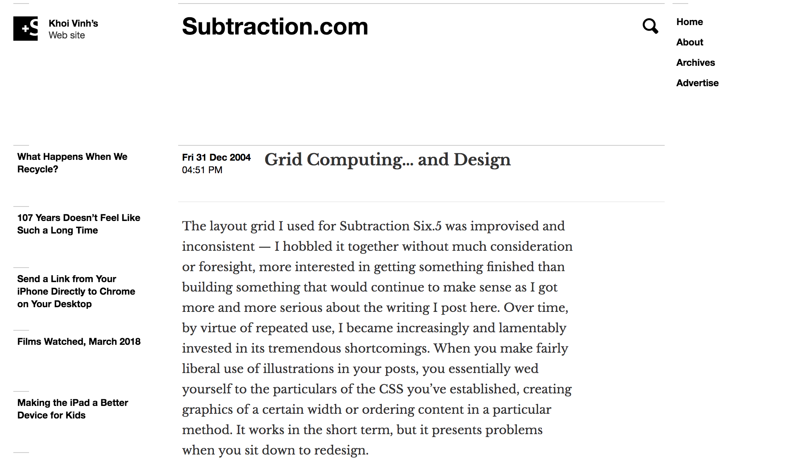
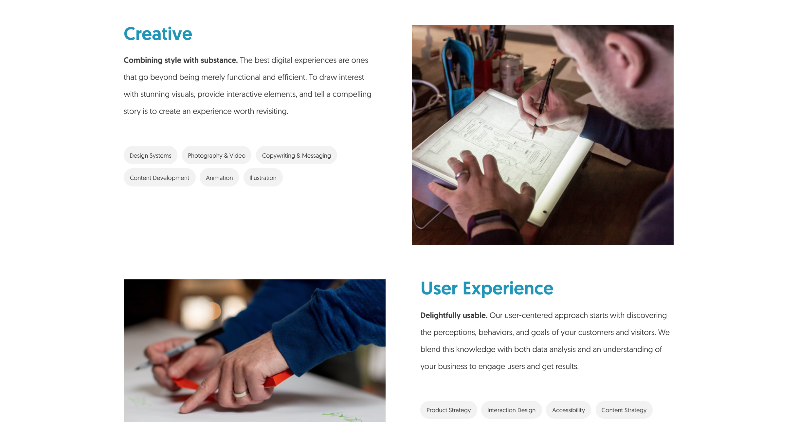

autoscale: true

# [fit] **Responsive design**

---

# Three components of responsive web design

1. A flexible, grid-based layout
2. Flexible images
3. Media queries

---

# The Grid



---


---



---

# Making a flexible grid

* Use percentages
* Include margins
* Grids don't have to be a certain number of columns or even columns of equal size
* For your grid container, consider % for width and px for max-width

---

# Flexible images

```css
img {
  max-width: 100%;
}
```

---

# An incantation required

```html
<meta name="viewport" content="initial-scale=1.0,width=device-width" />
```

^ width=device-width is important to make the rendering width the actual width of the device. Without this, the phone browser might render with a 960px width and scale it down to 320px.

---

# Media queries

```css
@media print {}
@media screen and (max-width: 1024px) {}
@media screen and (min-width: 768px) 
  and (max-width: 1023px) {}
```

---

# Where are my breakpoints?

* Designing for devices isn't really future-proof, so using whatever breakpoints you want for your design is best.
* But people like a set of standards
  * phones: < 768px
  * tablets: >= 768px 
  * desktops: >= 992px
  * big desktops: >= 1200px

---

# Mobile first

* Design the mobile version of your site first
* Enhance the page as it grows in width

